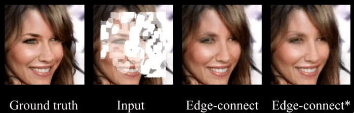

# AAGAN

This repository contains the code of the paper 
> AAGAN: Accuracy-Aware Generative Adversarial Network for supervised tasks
>
>Ilwi Yun, Hyuk-Jae Lee, Chae Eun Rhee.
>
> IEEE transactions on Circuits and Systems for Video Technology

## Introduction

* Ground truth: results of PCGAN (cropped from [presentation(youtube)](https://youtu.be/G06dEcZ-QTg),  
* Input: [testing irregular mask datasets](http://masc.cs.gmu.edu/wiki/partialconv),  
* edge-connect: Results of the generator trained using SNGAN,  
* edge-connect*: Results of the generator trained using AAGAN.

The demo shows the strength of AAGAN when applied to inpainting task. The boundaries of the masked region are noticeble in the results of Edge-connect which degrades the objective and subjective quality. Meanhwhile, boundaries of the mask are rarely visible in the results of Edge-connect* which implies that the proposed discriminator mitigates the trade-off between qualities.

## 1. How to implement to your own network

### prerequisites

Because our method is about a loss function of the discriminator, it is easily applicable to any other method if conditions below are met.

* Auto-encoder like discriminator
* Conditional Image generation tasks where ground truth exists, e.g. inpainting.

Note that, auto-encoder discriminator should output value range from 0 to 1.

### Implementation
To implement an AAGAN to your project, modify the code where GAN loss is caculated as follows.

* Accuracy-aware Discriminator

~~~python
#dis_input_fake : output of generator
#dis_input_real : ground truth
#dis_real,_ = self.discriminator(dis_input_real)
#dis_fake,_ self.discriminator(dis_input_fake)

zero = torch.zeros_like(dis_real,requires_grad=False)            
dis_real_loss = torch.mean(torch.abs((dis_real - zero)))                      # D_real

sel_images = dis_fake * images + (1.0 - dis_fake) * outputs.detach()
dis_fake_loss = torch.mean(torch.abs((sel_images - images)))                  # D_fake

disparity = torch.abs(images - outputs.detach())
disp_loss = torch.mean(torch.abs((dis_fake - disparity)))                     # D_reg

# Hyper parameters for each losses are ommitted here. Plaese set this manually.
dis_loss += (dis_real_loss  + dis_fake_loss  +  disp_loss)  # dis_loss -> loss of discriminator and should be backward later

~~~
* Relativistic Accuracy-aware Discriminator
~~~python
zero = torch.zeros_like(dis_real,requires_grad=False)
one = torch.ones_like(dis_fake,requires_grad = False)

dis_real = torch.nn.ReLU()(1.0 + (dis_real - dis_fake))                       # E_real
dis_real_loss = torch.mean(torch.abs((dis_real - zero)))                      # D'_real

dis_fake_sel = torch.nn.ReLU()(dis_fake - dis_real)                           # E_fake
sel_images = dis_fake_sel * images + (1.0 - dis_fake_sel) * outputs.detach()

dis_fake_loss = torch.mean(torch.abs((sel_images - images)))                  # D'_fake

disparity = torch.abs(images - outputs.detach())
disp_loss = torch.mean(torch.abs((dis_fake - disparity)))                     # D_reg

# Hyper parameters for each losses are ommitted here. Plaese set this manually.
dis_loss += (dis_real_loss  + dis_fake_loss +  disp_loss) # dis_loss -> loss of discriminator and should be backward later
~~~

* Generator
~~~python
# outputs : output of generator

gen_fake,_ = self.discriminator(outputs)
gen_gan_loss = torch.mean(torch.abs((gen_fake)))
# Pixel-wise loss is ommitted here. Plaese set this manually.
gen_loss += gen_gan_loss 

~~~

After caculating loss, backward and optimize according to your code.

## 2. Reproduction

To reproduce the results in the paper, follow the instructions contained in each folder (inpainting, FRUC).

## Citation
Will be updated soon.

## License
Our contributions on codes are released under the MIT license. For the codes of the otehr works, refer to their repositories.
